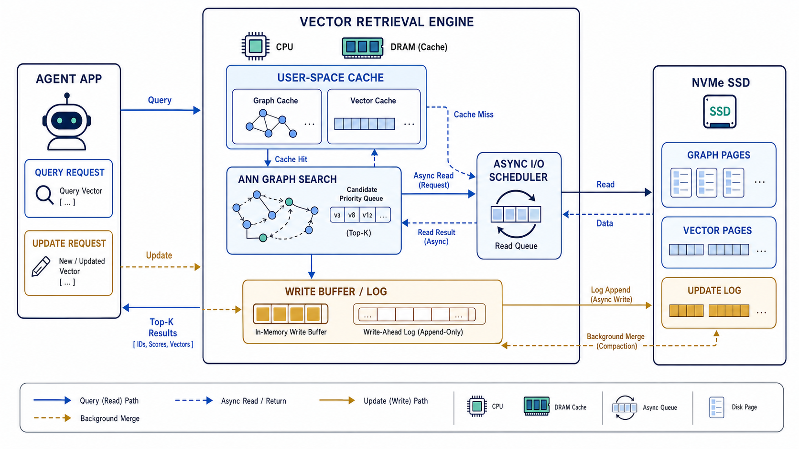
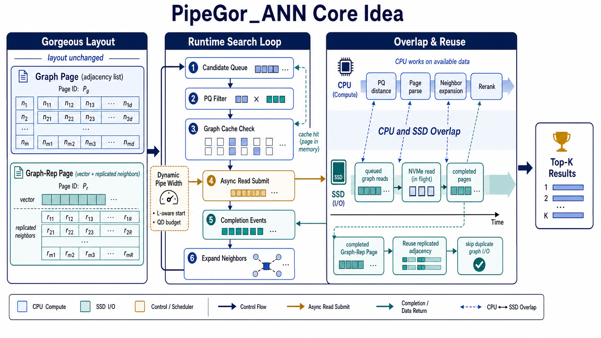
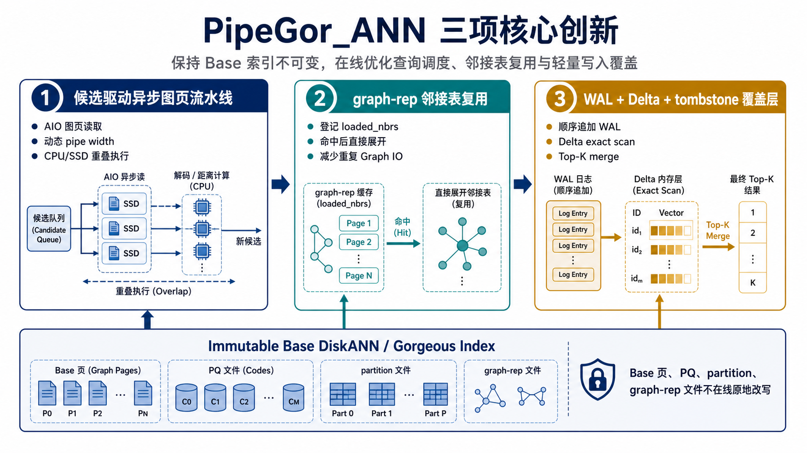
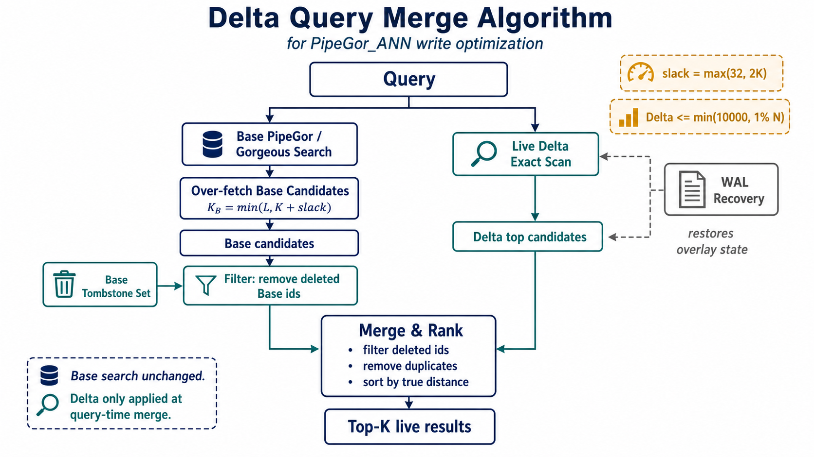

# PipeGor_ANN

PipeGor_ANN 是一个面向 SSD 外存近似最近邻检索（Approximate Nearest Neighbor Search, ANNS）的系统原型。项目以 DiskANN 的磁盘常驻图索引为基础，保留 Gorgeous 的页级磁盘布局和 graph-replicated 页面语义，引入 PipeANN 启发的运行时异步流水线读取，并在不可变 Base 索引之上补充 WAL + Delta + tombstone 的轻量写入覆盖层。

项目目标可以概括为：

- 在低内存、SSD 外存和高召回场景下，提高外存图搜索的吞吐和延迟表现。
- 在不重新定义 Gorgeous 磁盘文件格式的前提下，通过查询执行策略优化获得收益。
- 提供最小可用的动态写入能力，使插入、删除和 WAL recovery 能够在查询结果中可见。
- 保持实验可复现，统一输出 QPS、延迟、Recall@K、Graph IO、pipeline useful/wasted 和 Delta 扫描开销等指标。

## 项目概览

Agent 长时记忆检索通常会持续接收新增记忆、删除过期记忆，并频繁执行 Top-K 语义检索。当记忆向量和图索引规模超过物理内存后，系统瓶颈会集中在 SSD 随机读、图邻接表访问、缓存命中率和写入放大上。PipeGor_ANN 将这个问题拆成读优化主线和轻量写入覆盖层两部分：Base DiskANN/Gorgeous 索引负责大规模稳定数据，运行时流水线负责隐藏随机读等待，Delta 覆盖层负责小规模在线更新。



PipeGor_ANN 当前不是完整在线向量数据库服务，而是一个面向系统实验和竞赛评测的 C++ 原型。仓库提供索引构建、布局生成、搜索 benchmark、对比脚本、参数调优脚本和 Delta 写优化入口。

## 核心 Idea 与算法简述

PipeGor_ANN 的核心思想是：**保持 Gorgeous 磁盘布局不变，将优化集中在查询运行时。** Gorgeous 通过 graph page 和 graph-replicated page 提高单次磁盘读取的信息密度；PipeGor_ANN 在此基础上重新组织查询执行过程，使候选维护、PQ 距离计算、图页读取、页面解析和邻居扩展尽可能并行推进。



读路径主要包含以下机制：

1. **候选驱动异步图页读取**  
   查询线程维护候选集合、访问集合、AIO in-flight 请求和完成事件队列。候选节点不在内存图缓存中，且当前流水线宽度仍有余量时，系统提前提交图页读取请求；CPU 处理已返回页面时，SSD 可以继续服务后续候选。

2. **动态 pipe width 控制**  
   直接把流水线宽度开到 beam width 容易造成低质量预读。PipeGor_ANN 根据搜索宽度 `L`、beam width、线程数和全局队列深度预算选择保守初始宽度，并在搜索推进过程中逐步放宽。

3. **graph-rep 邻接表复用**  
   Gorgeous 的 graph-replicated 页面可能已经携带若干邻居的复制邻接表。PipeGor_ANN 在页面解析时把这些邻接表登记到 `loaded_nbrs`，后续候选命中时直接展开，跳过重复 graph I/O。

4. **精确向量重排与统计闭环**  
   PQ 过滤和流水线读取服务于候选发现，最终 Top-K 仍通过原始向量距离精排保证质量。benchmark 额外记录 `PipeSub`、`PipeUse%`、`PipeWst`、`Graph IO`、`Emb IO` 和 refinement 时间，用于解释性能来源。

写路径采用轻量 L0 覆盖层：

- Base 索引保持只读，不在线原地修改 `_disk.index`、PQ 文件、partition layout 或 graph-rep 页面。
- 插入和删除先顺序追加到 WAL，再更新内存 Delta Index 或 Base tombstone。
- 查询时先执行原有 Base page search，再对 live Delta 做 exact scan，最后过滤 tombstone 并合并 Top-K。
- 当 Delta 规模过大或 tombstone 比例过高时，应触发离线 rebuild/merge。

## 三项创新点



### 1. 布局保持下的候选驱动流水线搜索

PipeGor_ANN 没有通过重新生成磁盘布局来获得额外优势，而是复用 Gorgeous baseline 的主要文件结构，将优化集中在运行时调度层。这样可以更公平地比较 Gorgeous baseline 与 PipeGor_ANN，也能更清楚地解释性能提升来自 SSD I/O 与 CPU 计算的重叠。

### 2. graph-rep 页面内容的运行时复用

graph-replicated layout 提供了页面内复制邻接表，但运行时如果不识别这些信息，仍可能重复读取相同邻接表。PipeGor_ANN 显式维护 `loaded_nbrs`，把已返回页面中的复制邻接表转化为后续候选可复用状态，从而减少重复 Graph IO。

### 3. 不可变 Base 索引上的 WAL + Delta + tombstone 覆盖层

动态写入能力以最小侵入方式接入系统。Base 索引仍由 Gorgeous/DiskANN 风格文件承载，在线写入只进入 append-only WAL 和内存 Delta；删除通过 tombstone 生效；查询末端完成 Delta exact scan、Base tombstone 过滤和 Top-K merge。该设计已经覆盖插入、删除、恢复和查询可见性，但仍把大规模 graph-aware merge 留给离线 rebuild。

## 重要实验结果

读优化主实验来自 `results3` 公平设置：Gorgeous、PG_ANN 和 PipeANN 均使用 `mem_L=10`，因此适合比较 PipeGor_ANN 在相同内存导航条件下的收益。

| 线程数 | L | PG_ANN QPS | Gorgeous QPS | 加速比 | PG_ANN Recall@10 | Graph IO（PG/G） |
| --- | ---: | ---: | ---: | ---: | ---: | ---: |
| 32 | 35 | 24210.37 | 13586.39 | 1.78x | 90.78% | 26.55 / 55.03 |
| 32 | 40 | 21910.35 | 12582.23 | 1.74x | 92.37% | 29.36 / 60.19 |
| 64 | 35 | 26688.10 | 14537.32 | 1.84x | 90.77% | 26.55 / 53.34 |
| 64 | 40 | 24773.33 | 13403.82 | 1.85x | 92.34% | 29.34 / 58.08 |

关键结论：

- 在 Recall@10 高于 85% 的区间，PG_ANN 相比 Gorgeous 获得约 `1.7x--1.9x` QPS 提升。
- 代表性配置下 Graph IO 约减少一半，例如 64 线程、`L=40` 时从 `58.08` 降至 `29.34`。
- 流水线有效率较高，主实验代表性配置的 `PipeUse%` 接近 `98.8%`，说明预读请求大部分被搜索实际使用。
- 增强配置 `results2` 中最高达到 `3.44x` 加速，但该组 Gorgeous 与 PG_ANN 的 `mem_L` 不完全相同，因此只作为增强潜力展示。

写优化验证采用小规模回归索引和 SIFT1M 普通 page-search 路径：

- SIFT1M 上插入靠近查询的 Delta 向量并删除 Base top id 后，Top-1 可由自动分配的 Delta id `1000001` 补入。
- 重新加载同一 WAL 后，Top-K 结果序列保持一致，说明 WAL recovery 能恢复 live Delta 和 Base tombstone 状态。
- Delta 为空时，启用覆盖层后 QPS 仅下降 `0.98%`。
- Delta 增长时 Graph IO 基本不变，额外成本主要表现为 `Ext Cmp` 随 live Delta 规模线性增加，符合 flat exact scan 的设计预期。

## 系统安装与环境配置

推荐环境：

- Linux x86_64
- GCC/G++ with C++14/C++17 support
- CMake
- libaio
- Boost
- gperftools
- Intel oneAPI MKL / OpenMP，或兼容 MKL/OpenMP 环境

安装常用依赖：

```bash
sudo apt update
sudo apt install -y \
  build-essential \
  cmake \
  g++ \
  libaio-dev \
  libboost-all-dev \
  libgoogle-perftools-dev
```

如果发行版或本地软件源提供 MKL 包，也可以安装：

```bash
sudo apt install -y libmkl-full-dev
```

如果系统未安装 Intel oneAPI MKL，请根据服务器环境安装 MKL，并确认 `CMakeLists.txt` 中的 `MKL_ROOT`、`OMP_PATH` 能指向有效路径。当前 CMake 默认 Linux MKL 路径类似：

```text
/opt/intel/oneapi/mkl/latest
/opt/intel/oneapi/compiler/2022.0.2/linux/compiler/lib/intel64_lin/
```

初始化子模块：

```bash
git submodule update --init --recursive
```

当前仓库使用的子模块包括：

- `gperftools`: `https://github.com/gperftools/gperftools.git`
- `graph_partition/oneTBB`: `https://github.com/uxlfoundation/oneTBB.git`

## 构建与运行方式

### 1. 构建搜索可执行程序

从仓库根目录执行：

```bash
cmake -S . -B build -DCMAKE_BUILD_TYPE=Release
cmake --build build -j$(nproc) --target search_disk_index
```

主要搜索入口为：

```text
build/tests/search_disk_index
```

常用构建目标还包括：

```text
build/tests/build_disk_index
build/tests/build_memory_index
build/tests/search_memory_index
```

### 2. 使用脚本完成完整流程

进入脚本目录：

```bash
cd scripts
```

按顺序执行：

```bash
bash run_benchmark.sh release build
bash run_benchmark.sh release build_mem
bash run_benchmark.sh release split_graph
bash run_benchmark.sh release gr_layout
bash run_benchmark.sh release search knn
```

各阶段含义：

- `build`: 构建磁盘索引和 PQ 数据。
- `build_mem`: 构建采样内存导航图。
- `split_graph`: 拆分图结构和向量数据。
- `gr_layout`: 生成 graph-replicated layout。
- `search knn`: 运行 KNN 查询 benchmark。

### 3. 三方对比实验

主要脚本：

```text
scripts/compare_three_way_sift1m_t8.sh
```

该脚本用于比较：

- PipeANN baseline
- Gorgeous original baseline
- PipeGor_ANN

从仓库根目录执行：

```bash
env \
  RESULT_ROOT=/path/to/results \
  L_LIST='25 30 35 40 50 60 80 120 200' \
  MEM_L=10 \
  THREADS=32 \
  WIDTH=32 \
  bash scripts/compare_three_way_sift1m_t8.sh
```

运行后会生成时间戳目录，常见输出包括：

```text
PARAMS.txt
pipeann.log
gorgeous_original.log
pipegor.log
compare.csv
```

### 4. graph-rep 对比实验

主要脚本：

```text
scripts/compare_graph_rep_sift1m.sh
```

该脚本用于比较 Gorgeous graph-replicated layout 与 PipeGor_ANN graph-rep 查询路径，适合观察 `loaded_nbrs` 复用、Graph IO 变化和流水线有效性。建议同样从仓库根目录执行。

### 5. 关键运行参数

常用环境变量和命令行参数：

| 参数 | 含义 |
| --- | --- |
| `L_LIST` / `-L` | 搜索宽度，影响召回率、候选数量和查询开销 |
| `THREADS` / `--num_threads` | 查询线程数 |
| `WIDTH` / `--beamwidth` | beam width / I/O width |
| `MEM_L` / `--mem_L` | 内存导航图搜索深度 |
| `DECO_IMPL=1` | 使用 Gorgeous/PipeGor 风格查询实现 |
| `USE_DISK_GRAPH_CACHE_INDEX=1` | 使用 graph-replicated layout |
| `GORGEOUS_PIPELINED_GRAPH_IO=1` | 启用流水线 graph I/O |
| `GORGEOUS_PIPELINED_GRAPH_DYNAMIC_WIDTH=1` | 启用动态流水线宽度 |

## 写优化 Delta 覆盖层使用说明

Delta 覆盖层用于在不可变 Base 索引上提供小规模动态更新能力。查询路径如下图所示：Base search 先返回候选；若存在 Base tombstone，则进行 over-fetch；Delta 分支对 live entry 做 exact scan；最后统一过滤、去重和排序输出 Top-K。



### 1. 启用 Delta

Delta 需要 `deco_impl` 路径。运行 `search_disk_index` 时使用以下参数：

```bash
--enable_delta=1 \
--delta_wal_path /path/to/delta.wal \
--delta_ops_path /path/to/delta_ops.txt \
--delta_max_points 10000 \
--delta_fsync_every 100 \
--delta_fsync_interval_ms 100 \
--delete_filter_slack 32
```

参数说明：

| 参数 | 含义 |
| --- | --- |
| `--enable_delta=1` | 启用 WAL + Delta + tombstone 覆盖层 |
| `--delta_wal_path` | Delta WAL 路径；启用 Delta 时必填 |
| `--delta_ops_path` | 可选文本操作文件，用于 benchmark 前回放 insert/delete |
| `--delta_max_points` | live Delta 最大容量；默认按 Base 规模设置，上限通常为 `10000` |
| `--delta_fsync_every` | 每多少条 WAL 记录触发一次 fsync |
| `--delta_fsync_interval_ms` | 按时间窗口触发 fsync |
| `--delete_filter_slack` | Base tombstone 存在时 over-fetch 的补偿窗口 |

### 2. Delta ops 文本格式

`delta_ops_path` 支持以下格式：

```text
# 自动分配 Delta tag
insert auto <v0> <v1> ... <v127>

# 显式指定 tag
insert <tag> <v0> <v1> ... <v127>

# 删除 Base id 或 Delta id
delete <tag>
```

说明：

- `insert` 也可写为 `i`。
- `delete` 也可写为 `erase` 或 `d`。
- `#` 后内容视为注释。
- 向量维度必须与当前索引维度一致。
- 显式 tag 不能与 live Base 或 live Delta 冲突。
- 删除不存在 tag 时会记录忽略信息，不追加无效更新语义。

### 3. 能力边界

当前 Delta 层定位为 MVP 级 L0 写缓冲：

- 已实现：WAL 追加、WAL recovery、Delta 插入、Delta 删除、Base tombstone、Delta exact scan、Top-K merge。
- 未实现：在线 graph-aware merge、在线重连 Base 图、在线原地改写 graph-rep 页面、自动后台 compaction 服务。
- 建议：当 live Delta 达到上限，或 Base tombstone 比例持续升高时，触发离线 rebuild，把 live Delta 合并回新的 Base 索引。

## 仓库结构

```text
include/                 公共头文件、索引接口、Delta 接口
include/dynamic/         DeltaIndex 相关声明
src/                     核心实现
src/dynamic/             WAL + Delta + tombstone 覆盖层实现
tests/                   build/search benchmark 入口
tests/utils/             数据转换、ground truth、layout 工具
scripts/                 构建、搜索、对比实验、参数调优脚本
scripts/archive/         历史探索脚本
graph_partition/         图划分与 oneTBB 相关组件
assets/                  README 和报告使用的图示
CMakeLists.txt           顶层构建配置
LICENSE                  DiskANN MIT License
```

关键实现文件：

| 文件 | 作用 |
| --- | --- |
| `src/gorgeous/index_search.cpp` | 普通 layout 上的 PipeGor/Gorgeous page search |
| `src/gorgeous/index_search_dup_graph.cpp` | graph-replicated layout 上的查询与邻接表复用 |
| `src/dynamic/delta_index.cpp` | WAL、Delta 插入删除、recovery、ops 回放 |
| `src/dynamic/deco_delta_index.cpp` | Base search + Delta scan + Top-K merge 包装 |
| `tests/search_disk_index.cpp` | 磁盘索引 benchmark 统一入口 |

## 核心参考论文与 GitHub 地址

### 外存 ANN 基线与读优化

- DiskANN: Fast Accurate Billion-point Nearest Neighbor Search on a Single Node  
  GitHub: https://github.com/microsoft/DiskANN

- Starling: An I/O-Efficient Disk-Resident Graph Index Framework for High-Dimensional Vector Similarity Search  
  Paper: https://arxiv.org/abs/2401.02116  
  GitHub: https://github.com/zilliztech/starling

- Gorgeous: Revisiting the Data Layout for Disk-Resident High-Dimensional Vector Search  
  Paper: https://arxiv.org/abs/2508.15290  
  GitHub: https://github.com/yinpeiqi/Gorgeous

- PipeANN: Achieving Low-Latency Graph-Based Vector Search via Aligning Best-First Search Algorithm with SSD  
  Paper: https://www.usenix.org/conference/osdi25/presentation/guo  
  GitHub: https://github.com/thustorage/PipeANN

### 动态更新与写优化

- FreshDiskANN: A Fast and Accurate Graph-Based ANN Index for Streaming Similarity Search  
  Paper: https://arxiv.org/abs/2105.09613

- SPFresh: Incremental In-Place Update for Billion-Scale Vector Search  
  Paper: https://arxiv.org/abs/2410.14452

- In-Place Updates of a Graph Index for Streaming Approximate Nearest Neighbor Search  
  Paper: https://arxiv.org/abs/2502.13826

- LSM-VEC: A Large-Scale Disk-Based System for Dynamic Vector Search  
  Paper: https://arxiv.org/abs/2505.17152

## License

This repository is derived from DiskANN/Gorgeous-related code paths and currently follows the root `LICENSE`, which contains the DiskANN MIT License.

See `LICENSE` for details.
