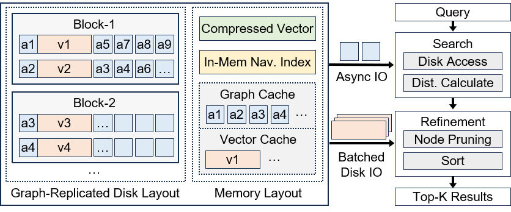
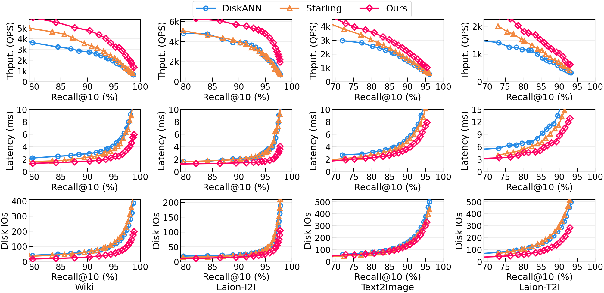

# PipeGor_ANN: High-Performance Disk-Based Vector Search

`PipeGor_ANN` 是我们当前使用的项目名称，表示在 Gorgeous 基础上继续融合 PipeANN 风格流水线优化后的版本。

本项目是在 Gorgeous 基础上使用静态缓存 + 动态缓存，并继续引入 PipeANN 风格流水线调度的方案。核心思想是在原论文静态 graph cache 的基础上，划分少量缓存空间作为可替换的动态 Cache，用于捕获查询过程中的热点邻接表，减少 SSD Graph IO，并在保持 Recall@10 的情况下提升 QPS、降低查询延迟。


PipeGor_ANN is a high-performance disk-based Approximate Nearest Neighbor Search (ANNS) system designed to efficiently handle large-scale high-dimensional vector datasets. It is built on Gorgeous and extended with PipeANN-style pipelined search ideas.

> **Note:** If you're using DiskANN for high-dimensional vector search in AI workloads, try PipeGor_ANN for significant performance improvements.

## 🚀 Quick Start

### Prerequisites

Install system dependencies:

```bash
apt install build-essential libboost-all-dev make cmake g++ libaio-dev libgoogle-perftools-dev clang-format libmkl-full-dev
```

### Build oneTBB Library

```bash
cd graph_partition
git clone https://github.com/uxlfoundation/oneTBB.git
cd oneTBB
cmake --build .
```

### Running Benchmarks

1. Navigate to the `scripts` directory
2. Modify dataset paths in `config_dataset.sh`
3. Run the benchmark:

```bash
bash run_benchmark.sh [debug/release] [build/build_mem/gp/split_graph/gr_layout/search]
```

#### Command Arguments

| Argument | Description |
|----------|-------------|
| `debug/release` | Build mode to run (passed to CMake) |
| `build` | Build the index |
| `build_mem` | Build memory index |
| `gp` | Graph partition given index file |
| `split_graph` | Generate Graph Index only file |
| `gr_layout` | Generate Graph-Replicated Storage Layout |
| `search` | Search the index |

### Configuration

Configure datasets and parameters in `config_local.sh`.

For detailed parameter descriptions and execution flows, see [scripts/README.md](scripts/README.md).

## 🏗️ Architecture & Design

<p align="center">
  
</p>

### Key Innovation

Traditional systems like DiskANN and Starling treat the index graph and full vectors equally, storing them together. PipeGor_ANN inherits Gorgeous's graph-priority design and further combines PipeANN-style pipelining to reduce disk access overhead and improve search efficiency.

### Core Techniques

- **Graph Priority Memory Cache:** Prioritizes graph caching over exact vector storage
- **Graph Replicated Disk Layout:** Replicate adjacency lists (the index graph) in disk pages instead of padding
- **Asynchronous Block Prefetch:** Prefetches disk blocks to reduce access latency
- **Tiny In-Memory Navigation Graph:** Uses a compact (0.5%) memory index for entry point discovery
- **Flexible Memory Configuration:** Adapts to various memory ratios with improved search efficiency at higher ratios

## 📊 Performance Comparison

PipeGor_ANN is our current integrated system, built on Gorgeous and extended toward PipeANN-style pipelined search. The original Gorgeous paper reports strong gains over other disk-based systems ([DiskANN](https://github.com/microsoft/DiskANN) and [Starling](https://github.com/zilliztech/starling)) under identical conditions (20% memory ratio, same CPU threads) on four 100-Million datasets:

<p align="center">
  
</p>

## 🔬 Research Paper

If you use PipeGor_ANN in project discussions or experiments, we recommend naming it as `PipeGor_ANN`. For the original paper citation, please still cite Gorgeous:

**[Gorgeous: Revisiting the Data Layout for Disk-Resident High-Dimensional Vector Search](https://arxiv.org/abs/2508.15290)**

```bibtex
@article{yin2025gorgeous,
  title={Gorgeous: Revisiting the Data Layout for Disk-Resident High-Dimensional Vector Search},
  author={Yin, Peiqi and Yan, Xiao and Zhou, Qihui and Li, Hui and Li, Xiaolu and Zhang, Lin and Wang, Meiling and Yao, Xin and Cheng, James},
  journal={arXiv preprint arXiv:2508.15290},
  year={2025}
}
```


## 📄 License

MIT License - see [LICENSE](LICENSE) for details.
